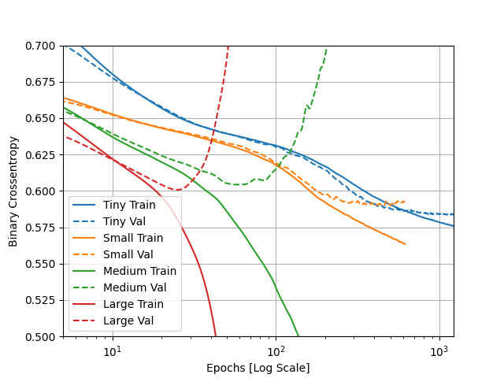

## Tuesday (7/13) Higgs Dataset Response

(1)Describe the dataset. What type of variable is the target? How many features are being used? 
How many observations are in the training dataset? How many are used in the validation set?

- 

(2) How did each of the four models perform (tiny, small, medium and large)? Which of the four models performed 
the best? Which ones performed the worst? Why in your estimation did certain models perform better? 
Produce a plot that illustrates and compares all four models.

- 

(3) Apply regularization, then add a drop out layer and finally combine both regularization with a dropout layer. 
Produce a plot that illustrates and compares all four models. Why in your estimation did certain models perform better?

- 

(4) What is an overfit model? Why is it important to address it? 
What are four different ways we have addressed an overfit model thus far?

- 

