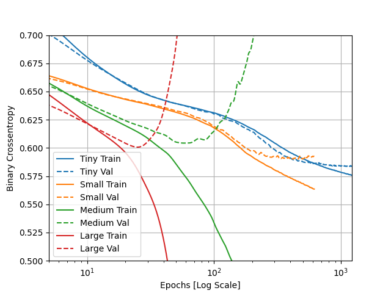

## Tuesday (7/13) Higgs Dataset Response

(1)Describe the dataset. What type of variable is the target? How many features are being used? 
How many observations are in the training dataset? How many are used in the validation set?

- 

(2) How did each of the four models perform (tiny, small, medium and large)? Which of the four models performed 
the best? Which ones performed the worst? Why in your estimation did certain models perform better? 
Produce a plot that illustrates and compares all four models.

- In regards to overfitting, the larger the model was the more overfit it tended to be. The tiny model had very little
issues with being overfit, as can be seen on the plot below. A similar trend can be seen in the small model, except it
  veers off in the end giving it some slight issue with fit. The medium and large models are both very overfit as
  they have the train and test data go in opposite direction in relation to binary crossentropy. I'm color blind so I'm 
  not 100% sure which line relates to which model, but it can be assumed based on other infromation that the large
  model is bar far the most overfit. I believe this issue with fit has to do with the model becoming more complicated
  as it gets larger. This complexity 

(3) Apply regularization, then add a drop out layer and finally combine both regularization with a dropout layer. 
Produce a plot that illustrates and compares all four models. Why in your estimation did certain models perform better?

- 

(4) What is an overfit model? Why is it important to address it? 
What are four different ways we have addressed an overfit model thus far?

- 

