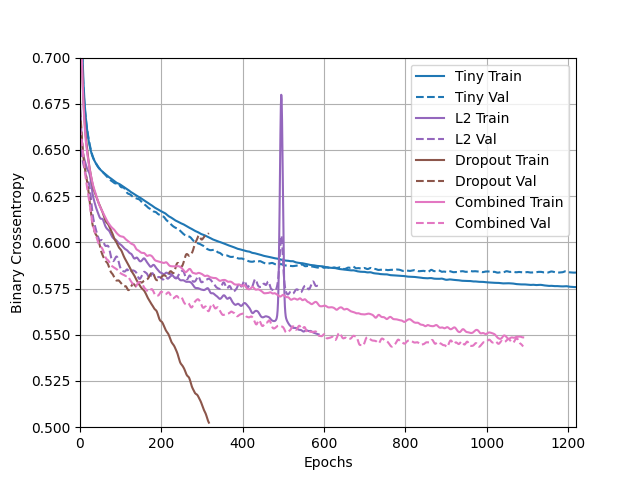

## Tuesday (7/13) Higgs Dataset Response

(1)Describe the dataset. What type of variable is the target? How many features are being used? 
How many observations are in the training dataset? How many are used in the validation set?

- The Higgs Dataset is a very large dataset, containing billions of data points. This is a much smaller snapshot of
that that has 11,000,000 examples, each of which have 28 features. 1,000 samples are used in the validation dataset, 
  and 10,000 are used in the training dataset. The target is a continuous variable. 

(2) How did each of the four models perform (tiny, small, medium and large)? Which of the four models performed 
the best? Which ones performed the worst? Why in your estimation did certain models perform better? 
Produce a plot that illustrates and compares all four models.

- In regards to overfitting, the larger the model was the more overfit it tended to be. The tiny model had very little
issues with being overfit, as can be seen on the plot below. A similar trend can be seen in the small model, except it
  veers off in the end giving it some slight issue with fit. The medium and large models are both very overfit as
  they have the train and test data go in opposite direction in relation to binary crossentropy. I'm color blind so I'm 
  not 100% sure which line relates to which model, but it can be assumed based on other infromation that the large
  model is bar far the most overfit. I believe this issue with fit has to do with the model becoming more complicated
  as it gets larger. This complexity comes with more power in the model which can cause issue if proper constraints 
  are not placed on this power.
  

(3) Apply regularization, then add a drop out layer and finally combine both regularization with a dropout layer. 
Produce a plot that illustrates and compares all four models. Why in your estimation did certain models perform better?

- Based on the plot above it appears that all the models performed fairly well except for the dropout model. It also
should be noted that there was an odd jump that recovered quickly in what I believe is the L2 model (once again I'm
  colorblind and the L2 model and tiny model colors look almost the same to me). The best performing model was the 
  combined model. I believe this model did the best due to it combining two different regularization techniques.
  Combining both works best because it both constrains the model to keep it simple and utilizes dropping out to do
  a great job of preventing overfitting.

(4) What is an overfit model? Why is it important to address it? 
What are four different ways we have addressed an overfit model thus far?

- An overfit model is one that trains too closely to the dataset and if not addressed it can make the model almost
useless for predicting future points. That is why an overfit model tends to have a much higher training accuracy than 
  testing/validation accuracy. In this model overfiting has been addressed in several different ways:
  
  (1) L1 regularization: A form of weight regularization that influences weights to move towards 0, in turn 
simplifying the model.
  
  (2) L2 regularization: Another form of weight regularization that is used more commonly. L2 differs in that it won't
make the weights sparse but instead penalize them, with smaller weights having a penalty that goes to 0.

  (3) Dropout: Randomly converts some outputs to zero since features cannot rely on other outputs this helps make
sure no features are codependant. 

  (4) Combination: As mentioned in question 3, this method led to the best model and is simply a combination of L2 
  and dropout.

