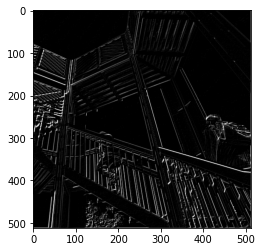
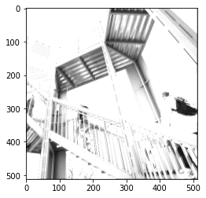
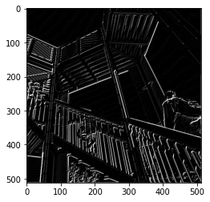
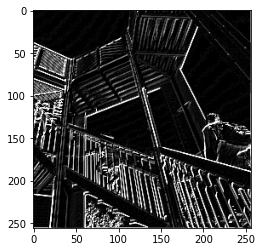
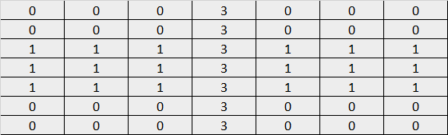

## Tuesday (7/13) Response for Thursday's Class

(1) In this exercise you manually applied a 3x3 array as a filter to an image of two people ascending an 
outdoor staircase. Modify the existing filter and if needed the associated weight in order to apply your new 
filters to the image 3 times. Plot each result, upload them to your response, and describe how each filter 
transformed the existing image as it convolved through the original array and reduced the object size. 

- The filter I applied to this image appears to have highlighted some of the vertical lines, but not all. Overall, this
was not the most effective filter in highlighting vital portions of the image for training.
  - filter = [ [2, 1, 0], [-2, 1, -2], [1, 0, -1]]

- An almost opposite effect of what was intended occurred here. Instead of highlighting key characteristics of the
stairs, it appears almost all of the image was highlighted, or at least significantly lightened in color. This is not
  a good example of the proper use of convolution.
  - filter = [ [1, -2, 3], [-1, -1, -2], [3, 0, 2]]
    

- The final filter I created was one that seems to have done a very good job of highlighting important features.
Compared to my first filter much more of key lines are highlighted, specifically the vertical lines.
  
    - filter = [ [-1, -1, 0], [-2, -2, 2], [1, 1, 2]]

(2) What are you functionally accomplishing as you apply the filter to your original array? 

- When each filter is applied to the original array they get multiplies together which then transforms the pixel. 
This is then done to every pixel which then in turn leads to a completely transformed image.

(3) Why is the application of a convolving filter to an image useful for computer vision? 

- Convolution is useful because it leads to a transformed image that highlights key aspects of the object in the
image. This makes it much easier for a model to correctly classify, or learn how to classify, an image.

(4)Another useful method is pooling. Apply a 2x2 filter to one of your convolved images, and plot the result.

(5) In effect what have you accomplished by applying this filter? 

- This filter has narrowed the image down to what it believes to be its most important aspects. It does this by taking
2x2 sections and only keeping the largest data point within each. As can be seen in the image is made the vertical
  lines stand out even more than they did before.

(6) Does there seem to be a logic (i.e. maximizing, averaging or minimizing values?) 
associated with the pooling filter provided in the example exercise (convolutions & pooling)? 

- There does seem to be logic for conducting pooling. It narrows down the image to what the model determines to be the
most important aspects, this leads to a smaller and less complex image. In the end this will make the model much 
  easier to train and allow for improved accuracy. 

(7) Did the resulting image increase in size or decrease? 

- The image decreased in size by quite a bit. It went from 500x500 to 250x250.

(8) Why would this method be useful? 

- As stated above, pooling simplifies a model to its most vital data points. This allows for the model to be easier 
trained and improves the accuracy that the model can achieve.

(9) Finally, review the following images from class and then convolve the 3x3 filter over the 9x9 matrix 
and provide the resulting matrix.

