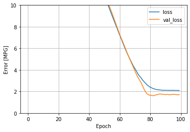
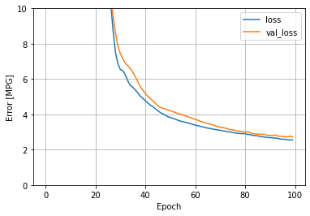

## Monday (7/12) Response

(1) Which of the two models produces a better loss metric? Produce a plot that supports your answer.
- In an effort to predict highway mpg a model was produced that included curb weight, number of cylinders, 
  engine size, and horsepower as features. The regular linear regression produced a better loss metric by a very 
  slight margin. The LR model produced a loss of 2.1871488094329834, while the DNN model had a loss of 
  2.9927163124084473. Here are the corresponding loss plots:

### Linear Regression Loss PLot

### DNN Loss Plot

(2) Return to the remainder of the variables from the dataset and add additional continuous and categorical features 
with the intent of improving your loss metric. Produce a plot that demonstrates the value of your model.
What is the best model you were able to produce?

- In an effort to improve the model I added bore, stroke, compression ratio, and peak rpm as features. Along with
these additions the previous features remained untouched. After rerunning the model both the LR and DNN models saw 
  improvements. LR has a loss of 1.625938057899475, while DNN had a loss of 2.8248660564422607. With the LR model 
  seeing such a significant improvement with the new features it was by far the best model I produced. 

### Linear Regression Loss PLot with added Features

### DNN Loss Plot with added Features

