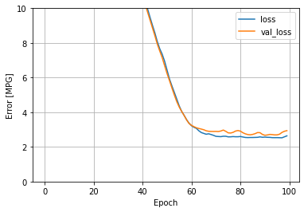
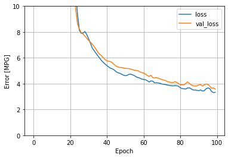

## Monday (7/12) Response

(1) Which of the two models produces a better loss metric? Produce a plot that supports your answer.
- In an effort to predict highway mpg a model was produced that included curb weight, number of cylinders, 
  engine size, and horsepower as features. The regular linear regression produced a better loss metric by a very 
  slight margin. The LR model produced a loss of 2.1871488094329834, while the DNN model had a loss of 
  2.9927163124084473. Here are the corresponding loss plots:

### Linear Regression Loss PLot

### DNN Loss Plot

(2) Return to the remainder of the variables from the dataset and add additional continuous and categorical features 
with the intent of improving your loss metric. Produce a plot that demonstrates the value of your model.
What is the best model you were able to produce?

- In an effort to improve the model #add features and test

