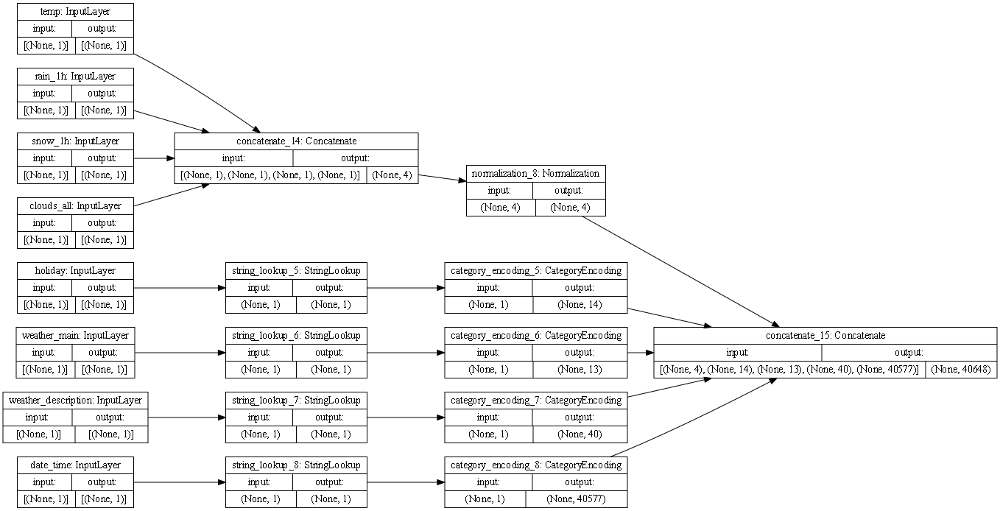

## Monday (7/19) Response

(1) Use the `plot_model()` command from `tf.keras.utils` to produce the plot that describes the input preprocessing 
step.  Describe the plot of each model for the two dataset preprocessing steps.  
What does each box in the illustration represent?
Are there different paths towards the final concatenation step?
What is occurring at each step and why is it necessary to execute before fitting your model.

- This is the plot that represents the preprocessing steps for the iris dataset. The first set of boxes shows all the
features in their current states. Since all the variables are continuous there is only one path from this point 
  forward. Moving on to the second group, this is where the first concatenation step happens. This means that 
  all the features are consolidated into one string. After this normalization occurs followed by another 
  concatenation step. 
  

- The traffic volume preprocessing steps are represented by the plot above. Just like the iris dataset the first 
  group is all the features of the dataset prior to being altered. Unlike the prior dataset this data contains several
  categorical variables that must be treated differently than the continuous variables. As can be seen in the plot,
  all the categorical variables avoid the first concatenation step and instead partake in string lookup which is then
  followed by category encoding. Both of these alternative steps lead to these features being converted into dummy 
  variables. This means that in this dataset there are indeed multiple paths that lead to the final concatenation step.

- To give slightly more detail on why each step is important, without concatenation the different
  features would not be merged into one string, making it difficult to run a model. The normalization step is then vital
  to make sure these merged strings are of a common scale. This allows the model to be more accurate. Then a final
  concatenation step occurs to account for any features that may have not been included in the first concatenation step
  due to them being categorical variables. The alternative steps that convert those categorical variables into dummy 
  variables are vital because they allow for all features to be numerical and consistent. 

(2) Train each model and produce the output (not necessary to validate or test).  
Describe the model output from each of the trained metro traffic interstate dataset and the iris flowers dataset.

- 

- 

(3) What is the target for each dataset?

- The target for the iris dataset is to correctly identify the species of iris the plant is. The three potential 
options being setosa, versicolor, and virginica.

- The target for the second dataset is the volume of traffic present.

(4) How would you assess the accuracy of each model?  
Are you using a different metric for each one?  Why is this so?  What is each one measuring?

- 

- 

 