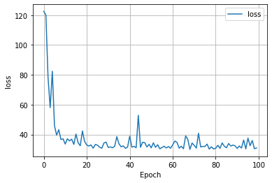

## Project 1

(1) How did your model fare?

-  

(2) In your estimation is there a particular variable that may improve model performance?

-  

(3) Which of the predictions were the most accurate? In which percentile do these most accurate predictions reside?
Did your model trend towards over or under predicting home values?

-  

(4) Which feature appears to be the most significant predictor?

- 
 
