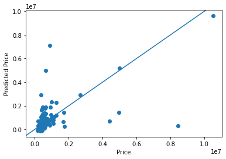

## Project 1

(1) How did your model fare?

-  Using the zillow scraper I gathered data from an abundance of homes within the City of Charlottesville. Originally, I
had planned to use Chicago, but with too outliers and variance in the price based on location in the city I decided to 
   switch locations. The model for homes in Charlottesville fared pretty well, with many of the lower value homes 
   doing very well. When it came to the higher value homes there was a much higher variance in success, as can be seen
   on the plot. 

(2) In your estimation is there a particular variable that may improve model performance?

-  

(3) Which of the predictions were the most accurate? In which percentile do these most accurate predictions reside?
Did your model trend towards over or under predicting home values?

-  The predictions closer to the lower price ranges tended to be much more accurate. This would equate to homes within
the lower percentiles to be much more accurate. In regards to over and under predicting values, it appears that there is
   about an even mix of both amongst the predictions.

(4) Which feature appears to be the most significant predictor?

- 
 
