## Project 3

(1) Binary Target Models

- Best

    - The highest wealth group had had the best binary model by far, reaching accuracy's in the high 90s. There was no 
    issues with being overfit as the test accuracy was 0.9608046412467957, which was right on par with the training
      accuracy. In terms of other modifications I the setting used the other day remained the most effective. The batch
      size was left at 256, the optimizer adam performed the best compared to others I tried, and all the features
      were assigned to the correct Keras Preprocessing Layers. 

         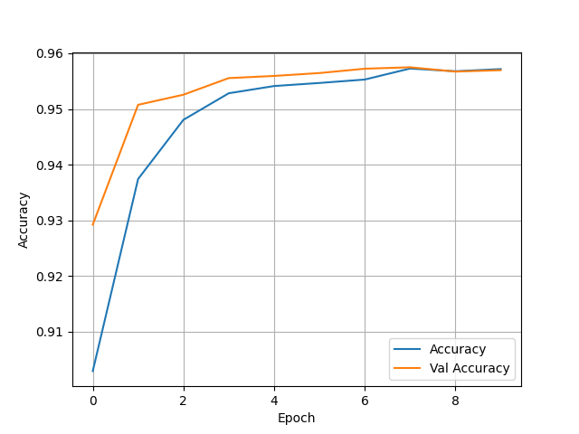

- Worst 

    - The second wealth group had the worst accuracy, resting in the low 70s. It also was not overfit with a test 
  accuracy of 0.7417047023773193. Although, the accuracy also seems to remain for stagnant across epochs which is 
      very odd.
    
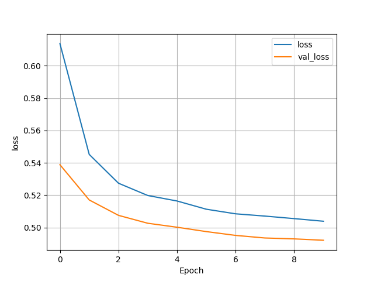         

- Confusion Matrix and Analysis 

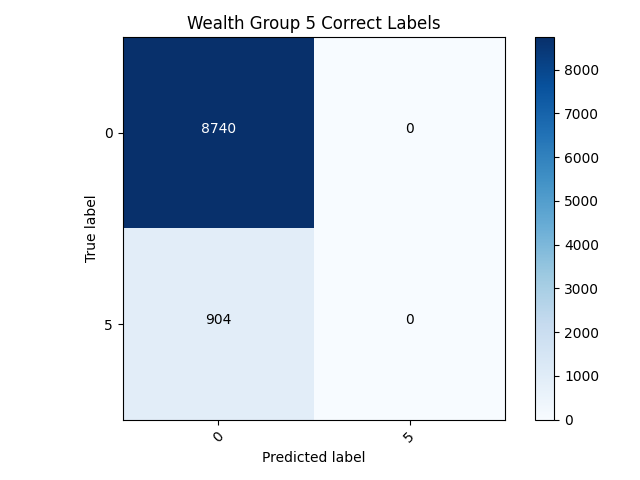         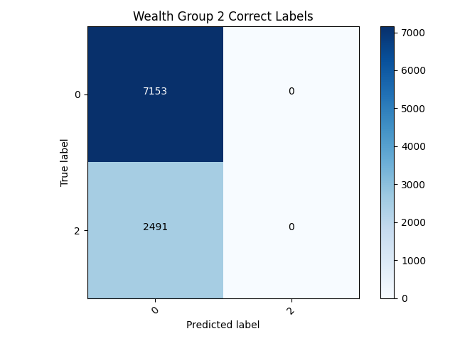

   - After examining the confusion matrix's for both models it quickly can be discovered that neither model is really
that good. The only reason the 5th wealth class has such a higher accuracy is because it has less individuals within it
     than any of the other classes. This model has failed to classify any of the target's correctly within the binary
     model. This puts forth the idea that accuracy cannot always be trusted as an accurate measurement, especially within
     a binary model like this.

(2) Categorical Target Models

- The model that examines all categorical targets did very poorly. It had a test accuracy of 0.5162795782089233 and 
the training and validation accuracies were both very low as well. To calculate loss for this model I used
  Sparse Categorical Crossentropy; similarly, I used Sparse Categorical Accuracy to get the accuracy. I also needed
  to change the density in the last layer of the model to six to get the model to run and account for all five
  targets.

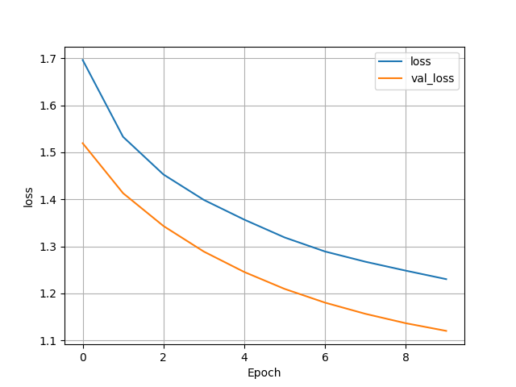

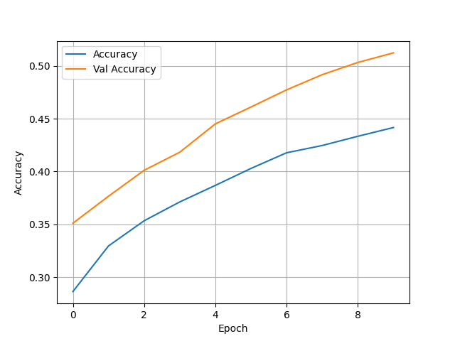

- Confusion Matrix and Analysis 

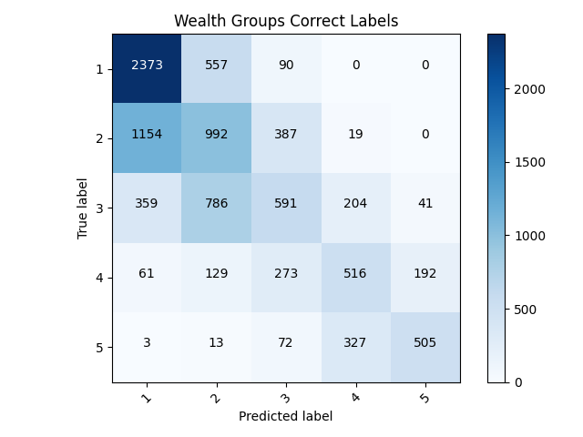

  - Examining the confusion matrix this model did much better than the last because it could actually classify some
of the variables. It appears most of the misclassified individuals were typically not too far from their correct class,
    usually being only one over. With some more work, this model has lots of room for improvement. 

(3) Results of structured data with feature columns models

- Initial Model

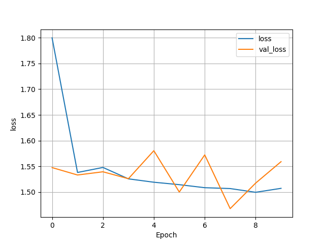

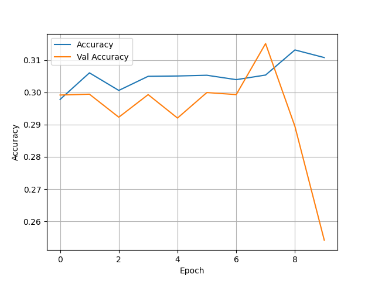

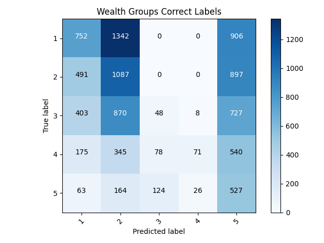

  - This model is very poor, much worse than the previous categorical model with the preprocessing layers. It has an
abysmal accuracy and pretty much fails to classify all individuals in the second and third wealth classes. In regards
    which features I put in each feature columns I kept it pretty simple. I put weights and units as numeric, I
    bucketized age, size, and education, and then I placed location, cook, car, electric, toilet, potable,
    gender all within indicator columns. 
    

(4) Model Improvement

- With the feature columns model performing so poorly I decided to make some changes to the categorical keras
  preprocessing layers model in an effort to make improvements.
    - After toying around with dropping various features and combinations of features I found no combination of variables
that improved my model. This is very odd, even when I removed the features that were missing a lot of data points the
  model still seemed to be better off beforehand. 
      
- With there being a very low accuracy in my multiclass feature column model, I feel that it would be worth going back 
  and trying to improve. I began my dropping the columns unit and weights as I feel they are not the most important. I 
  then went back and redid some of my columns as I think I made some errors in my assigning of features. I changed it so
  age was my only buckitized column, and then size, age, and education were all numeric. The indicator columns were all
  left the same as the previous model.
    - These changes drastically improved the model, with a test accuracy of 0.5774574875831604. This makes it my best
  multiclass model yet. Below are my graphs and confusion matrix:
      
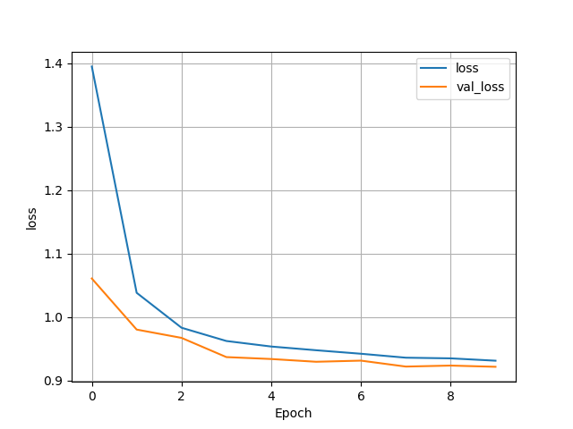

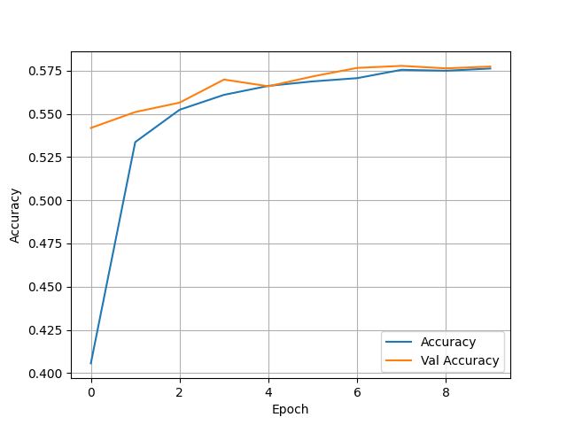

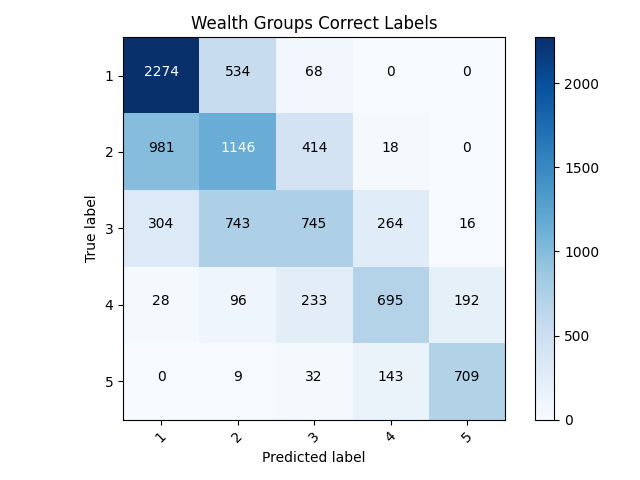

- Before settling on this as the best model I wanted to pursue some variable improvement. To test this I made some 
slight changes to the toilet feature. Due to there being many aspects of the feature that could be combined into one I
  consolidated the variables into three columns. After doing this I ran the model to see if it was worth pursuing for
  other features as well. The resulting model was actually slightly worse, with a test accuracy of 0.5682289600372314.
  With this being said I think the previous model may be the best model to stick with.
  
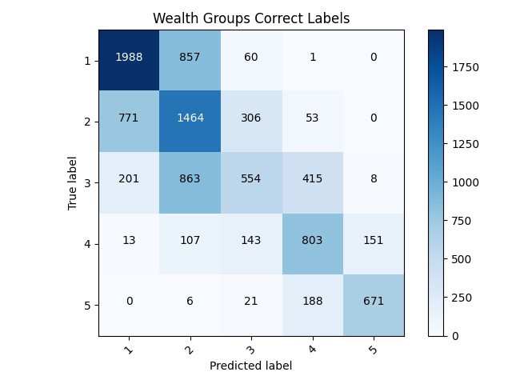