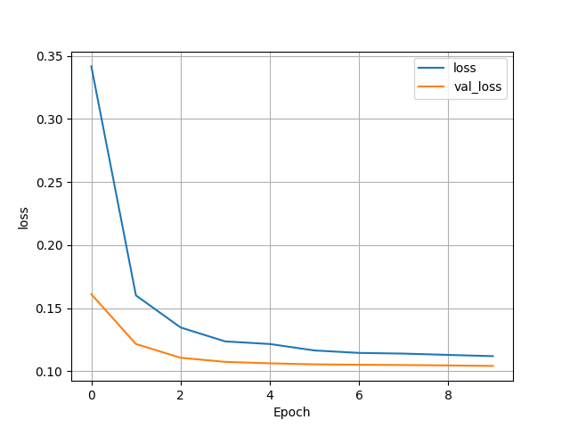
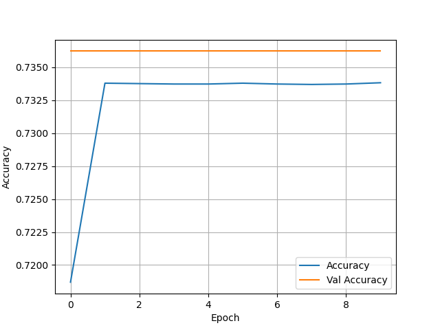

## Project 3

(1) Binary Target Models

- Best

    - The highest wealth group had had the best binary model by far, reaching accuracy's in the high 90s. There was no 
    issues with being overfit as the test accuracy was 0.9608046412467957, which was right on par with the training
      accuracy. In terms of other modifications I the setting used the other day remained the most effective. The batch
      size was left at 256, the optimizer adam performed the best compared to others I tried, and all the features
      were assigned to the correct Keras Preprocessing Layers. 

         

- Worst 

    - Filler text
    
         

- Confusion Matrix and Analysis 

         

(2) Categorical Target Models

- Best

- Worst

- Confusion Matrix and Analysis 

(3) Results of structured data with feature columns models
