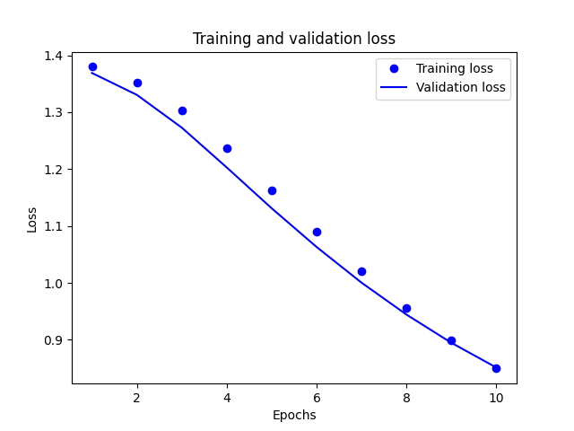
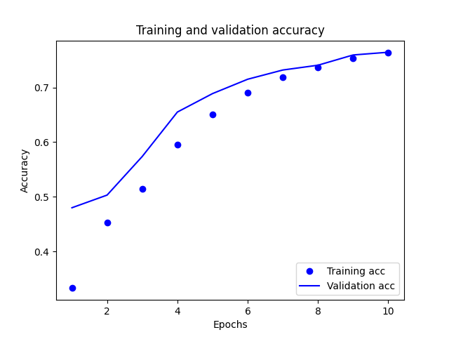

## Thursday (7/8) Response: Alaa, Huatao, & Tyler

(1) Provide plots that describe the training and validation loss and accuracy. 
Interpret the plots. How is this model performing?

-  Basing it off the plots, our model seems to be fit pretty well in regards to the loss. There is a slight point where
it drifts away towards the middle, but it's not by much and gets backs on track very quickly. Shifting focus to the
   accuracy plot there does seem to be some trouble. The validation accuracy starts very off track before shifting
   direction and turning into a much more fit model. Due to this being a very complex model, the accuracy of the model
   shows that it is preforming well.
(2) Export the model and print the accuracy produced 
using the test data. Does the test data accuracy serve to validate your model?

-  0.7278749942779541
   
- The accuracy of the exported model successfully validates our model due to this being a rather complex model and
  consistent with the accuracy that was tested for earlier. 

(3) Produce three examples that are relevant to the multi-class classification model and 
predicting the language relevant to the stack overflow question. 
Produce the array generated by each of your three examples. Were these predictions accurate?

    - array([[0.5091311 , 0.4838978 , 0.5061942 , 0.49897957],
       [0.5577617 , 0.48751166, 0.49878988, 0.44436145],
       [0.54727465, 0.4952414 , 0.4906906 , 0.45755982]], dtype=float32)
- The first question was supposed to be Python, second Java, and third Csharp. This means that the first and second are
both incorrect as it incorrectly choose csharp. The third, which was supposed to be Csharp, was the only correct result.
  This equates to a 1/3rd success rate which is very inaccurate. 

(4) Compare your multi-class model with your binary class model that predicted sentiment as either 
positive or negative in response to various movie reviews. What is the most significant difference between the two 
different types of models? 
Compare the two models and estimate which demonstrated better performance? Substantiate your response.

- The most obvious difference between the two lies in the amount of categories present. The predicted sentiment was a
strictly binary class model, while this one had four possible categories. The few groups that data can be a part of
  allowed it to be a much more accurate model, hovering in the upper 80s in terms of percent accuracy. This is much
  more accurate than the 72% accuracy of this model. 