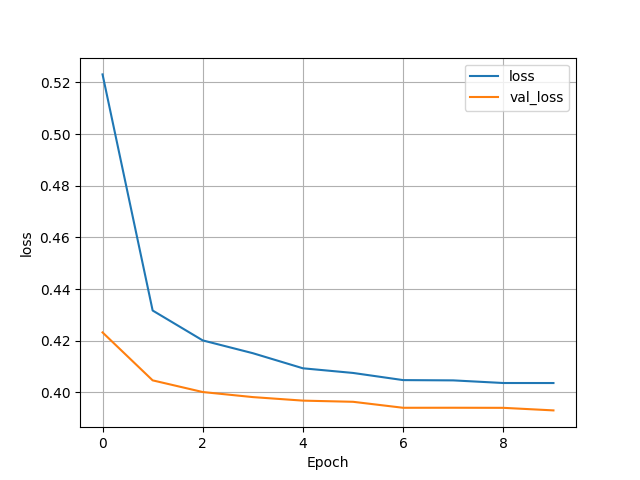
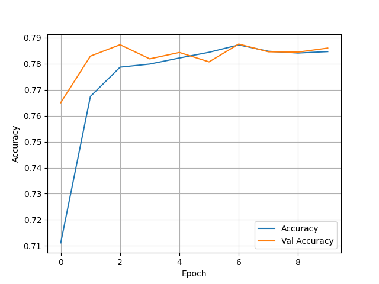
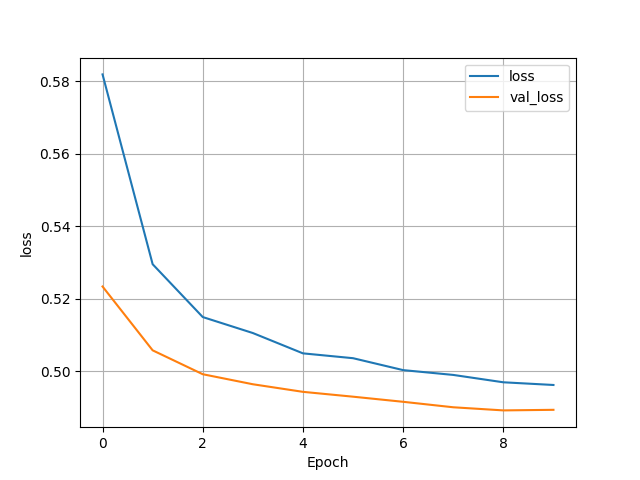
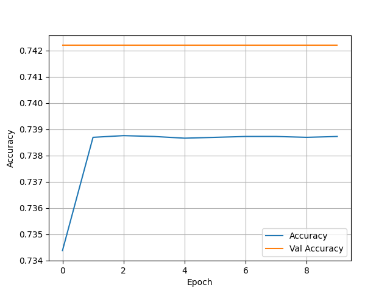
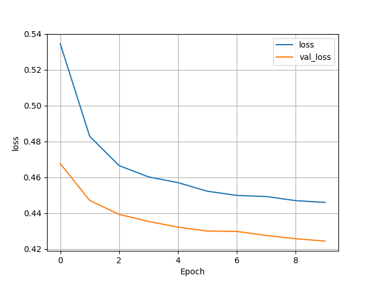
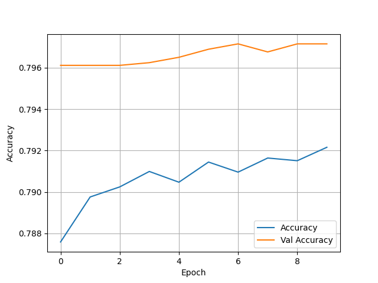
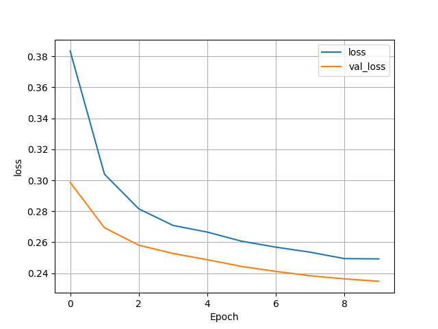
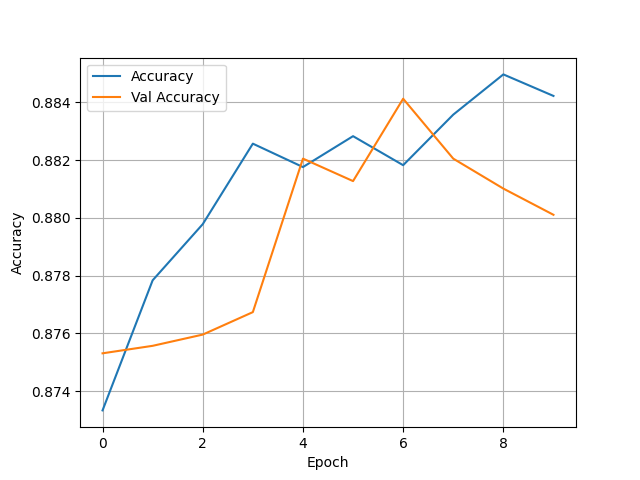
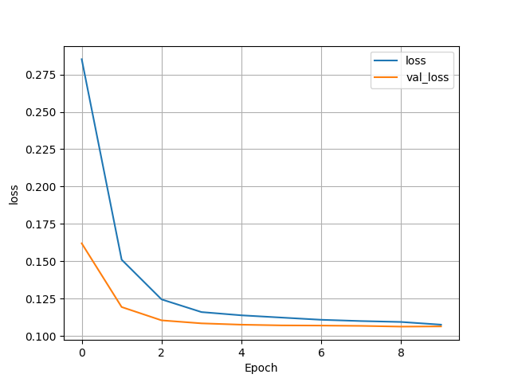
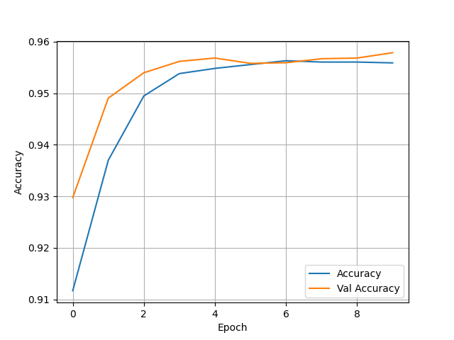

## Thursday (7/15) Response: Tyler & DJ

(1) Overview of Model

- This dataset contains a variety of different features that can be utilized to create a model that can predict an
individual's wealth. Before the model could be put together we made sure to drop hhid and pnmbr from the dataset as we
  felt they were not necessary. From there we imputed the features that were to be used based on what type of variable
  they were. The first step was to input the numeric variables, in this case weights were the lone variable here. The 
  next section was the categorical variables that were encoded as integers. There were an abundance of features here,
  such as: age, gender, size, education, and unit. The final aspect was to input the categorical variables that were
  encoded as strings. These features consisted of location, cook, car, electric, toilet, and potable. Once these steps
  were completed training could begin. Our model didn't alter much from the initial code, as we left the batch size at
  256 and left the optimizer unaltered. We ran the model for each level of wealth and the results are listed below.

(2) Wealth = 1

- Test Accuracy: 0.7904396653175354

(3) Wealth = 2

- Test Accuracy: 0.7209663987159729

(4) Wealth = 3

- Test Accuracy: 0.788676917552948

(5) Wealth = 4

- Test Accuracy: 0.880029022693634

(6) Wealth = 5

- Test Accuracy: 0.959767758846283

(7) Final Observations 

- Overall, this model performed much better than the yesterday's analysis of the city data. There also was almost an 
inverse of which wealth group had the most accurate model. The first wealth group saw an accuracy of just below 0.79,
  which is bigger than the second group, who had accuracy's in the low to mid 70s. Group three then saw accuracy rise 
  back up to be almost the same as group 1. Both wealth group's 4 and 5 saw a massive jump in accuracy. Group 4 had an 
  accuracy in the high 80s and group 5 reached the very high 90s. This shows that as wealth gets higher the feature's
  we used were much better indicators. This model had zero issue with being overfit as the training and test data 
  were almost always on par with one another.