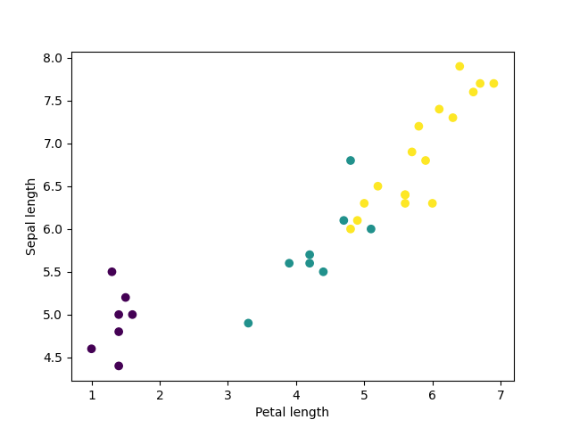
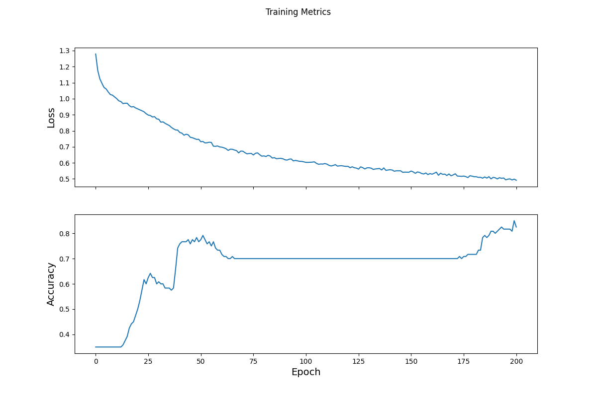

## Tuesday (7/20) Response

Describe the following

(1) The data

- The data used originates from TensorFlow’s iris dataset. This dataset contains 120 various flowers that can all be 
  split into three different classifications of iris. These three types of iris are setosa, versicolor,  and virginica. 
  There are also four features that make up the dataset: sepal length, sepal width, petal length, petal width. 
  The goal of the model we created with this dataset is to train a model to take those features and then assign 
  which type of iris the flower is most likely to be.

(2) How you created the tf.dataset

- Once the dataset is downloaded, the tf.dataset is able to be created. The first step in this process is to assign 
  a batch size and convert the training data into a usable format. Tf.data.experimental.make_csv_dataset is used to 
  do this step. After this step, a plot can be used to look for clusters in the data, see an example below. The last 
  step here was simply the creation of a function that would make modeling easier by packing all the features into a 
  single array.

(3) Describe the model itself, input shape, model architecture/layers and any functions (softmax/argmax)

- The model itself is creating using Keras and contains three different layers. The first layer is the only one that 
  requires an input shape, the input shape in this model is four due to there being four total features. The third 
  layer is the final layer and it has a density of three due to there being three potential flowers that the model can 
  predict a flower to be. There are also several functions that are utilized in the model, such as softmax and argmax. 
  Softmax is used to convert the logits that arise when a batch of features passes through to an actual probability. 
  Argmax is used to give us the most likely target that the flower belongs to.

(4) Describe the process of training the model and what optimizer was used

- The first step in training the model is to assign the metric to measure loss. For this model, Sparse Categorical 
  Crossentropy is used to do there being multiple categorical targets. Simple Categorical Crossentropy could probably 
  be used as well since there are only three targets. Once the loss is defined, a gradient, which will help optimize 
  the model, is also defined. The next step is to create an optimizer. The specific optimizer used here is stochastic 
  gradient descent or SGD for short. SGD works to minimize loss by doing what I assume to be searching for a better 
  local minimum within the model that will allow for higher accuracy. Once the optimizer is in place, the training loop 
  step can begin, and the model’s accuracy can be seen.

(5) Plot and describe the loss function over time

- The loss function in this model sees consistent improvement throughout each epoch. At the start, the loss is 
  relatively high, sitting around 1.3. It then quickly drops below one before seeing it steady out around 0.5 by 
  the final epoch. These results equate to an adequate model that could be improved upon to be made even better.

(6) Describe evaluating the model w/ your test dataset

- The model can then be evaluated by loading in the test dataset to see how the model performs on new data. 
  This can examine for overfitting as well as check for the overall effectiveness of the model. 
  When the test data was loaded in, an impressive accuracy of 96.667% can be seen. 
  This accuracy shows that our model was successful and had minimal issues with overfitting.

(7) Make some predictions

- The final aspect of the model I’ll examine is its ability to predict what class future flowers belong to by 
  assigning it new feature data. To test this I passed an array into the model using the tf.convert_to_tensor feature. 
  The array contains data for three flowers and has numeric values for each of the four features.
    - Here is the array of values I put into the model to make predictions:
    -       [7.1, 4.2, 2.6, 1.5,],
            [3.2, 1.2, 1.5, 0.7,],
            [6.3, 4.1, 2.2, 2.1]
    - The predicted type of iris for each flower are as follows:
    -       Example 0 prediction: Iris setosa (87.8%)
            Example 1 prediction: Iris versicolor (71.6%)
            Example 2 prediction: Iris setosa (82.6%)