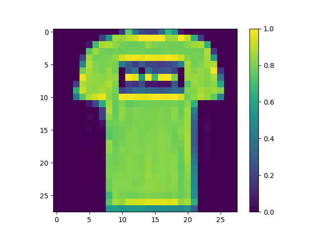
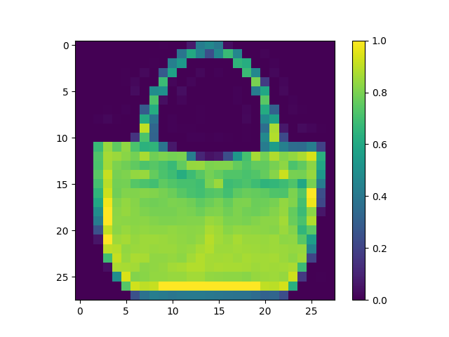
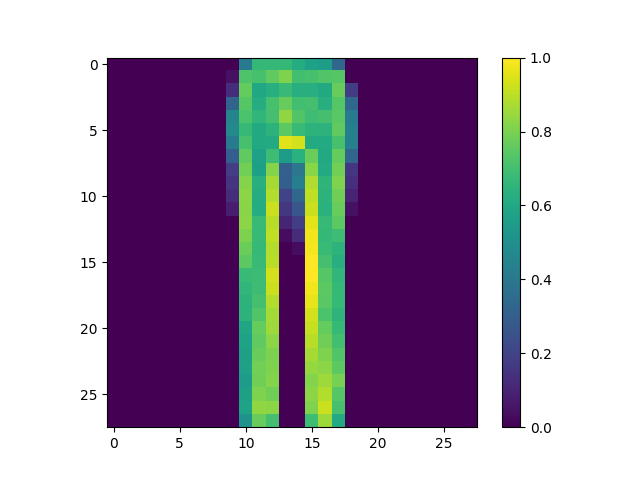
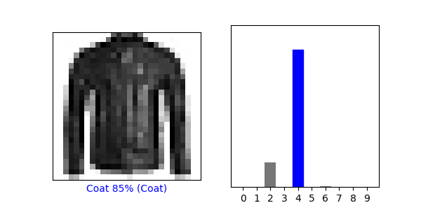
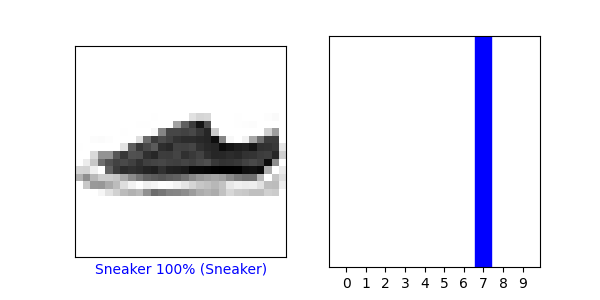
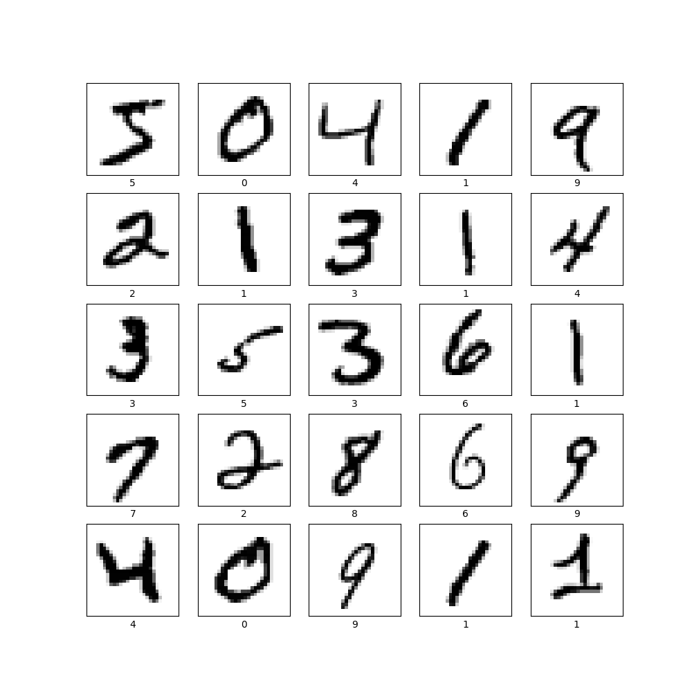
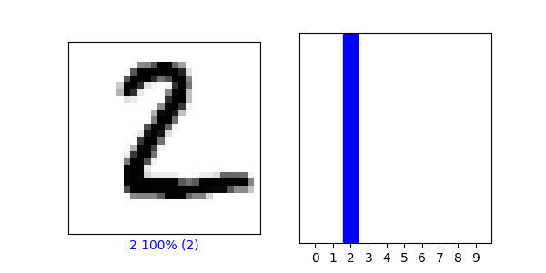
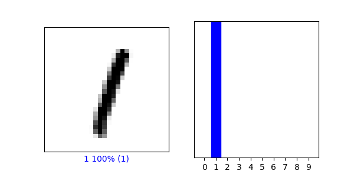

## Wednesday (7/7) Response

(1) From the Preprocess the data section of the script, modify the training image to produce three new images.

 
 

    

(2) Under the Make predictions section, present the array of predictions for an image from 
  the test set other than the one given in the example script. What does this array represent? 
  How were the Softmax() and argmax() functions applied? Read this post from DeepAI, 
  What is the Softmax function for a description of the two functions (focus on the softmax 
  formula, calculating softmax and the softmax vs. argmax sections). Does the output from 
  np.argmax() match the label from your test_labels dataset?

      - predictions[50]:  array([4.2334945e-05, 2.7757805e-08, 4.8826568e-02, 6.8814859e-10,
       4.1657707e-01, 3.3460002e-13, 5.3455389e-01, 5.8882500e-13,
       7.5764532e-08, 3.8225739e-08])

- This array represents the confidence our model has in each of the different clothing types being present in image 51.
- Within this section softmax was used in the first line of code to help convert the logit's 
  that were created earlier into probabilities. It also normalizes the data to be between 0 and 1, 
  this part of the function is housed in the bottom portion of the formula. It does this because 
  it will convert every value to 0 except for the maximum. It will display this in the form of an array where all the 
  values will add to 1. Although it is often used in place of argmax, when it 
  comes to situations involving inference within a model argmax is preferred. This is because argmax puts out a single 
  value which is better in many instances.
- The output from argmax does not match the label, as argmax equals 6 and the test label comes 
  out to 4. Model's can never be 100% accurate, but with more training the model could be 
  better fit to increase the odds of the prediction choosing the correct label.

    

(3) Under the Verify predictions section, plot two additional images 
  (other than either of the two given in the example script) and include the graph of 
  their predicted label as well as the image itself.

    

(4) Under the Use the trained model section, again select a new image from the test dataset.
  Produce the predictions for this newly selected image. Does the predicted value 
  match the test label? Although you applied the argmax() function in this second instance, 
  you did not use Softmax() a second time. Why is that so (please be specific)?

- The predicted value once again does not equal the test value in this example; although, the correct label was 
  the second most likely option according to the model.
  
- There is no need to use softmax at this point because the data had already been converted to probabilities. It also 
is more efficent to use argmax here because, as stated earlier, in instances where you are infering labels it is best
  to use argmax as it will give you a single defanite prediction. 

    

(5) Produce a plot of 25 handwritten numbers from the data with their labels indicated below each image. 
Fit the model and report the accuracy of the training dataset. Likewise report the accuracy of the test dataset. 
As in the above example, from the Verify predictions section, plot two images and include the graph of their 
predicted label as well as the image itself.

- This model currently has a test accuracy: 0.9764999747276306 and a training accuracy: 0.9941499829292297

  

(6) Which of the two models is more accurate? Why do you think this is so?

- Both models are decent models, but the MNIST is by far the more accurate model. Fashion_MNIST reaches a peak accuracy
of around 91%, while MNIST pushes close to 98%. Fashion_MNIST still preforms fairly well considering the complexity of
  the images within the model. 
  
