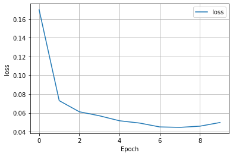

## Wednesday (7/21) Response

(1) Overview of Model

- The dataset from this model looks to examine how various features of an individual can help to predict someone's 
wealth. The specific features are rather simple, being age, gender, size, and education level. Due to there being so 
  few features, setting the feature columns wasn't that complex of a task. Age was the only feature that I placed
  in the numeric column. Age also was bucketized along with edu. The remaining features, size and gender, were both 
  placed in indicator columns. The final step I did prior to training was create a crossed column for edu and age since
  they are highly correlated. 

(2) Wealth = 2

- The model appears to be very successful, with an impressive accuracy and minimal loss. The model does not deserve too
much praise because most of its success can be attributed to the fact it is the least common wealth class by far. This
  makes it much easy to train because there is much less data to examine. With this being said this model should not
  be considered that impressive due to the limited amount of class 2 wealth points available to train.
  
(3) Wealth = 3

- 

(4) Wealth = 4

- 

(5) Wealth = 5

- 