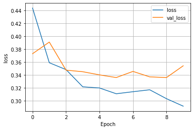
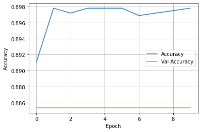
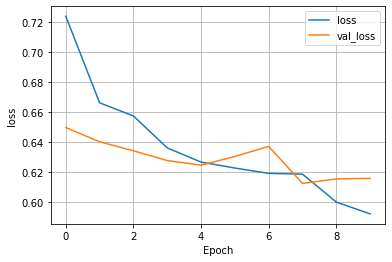
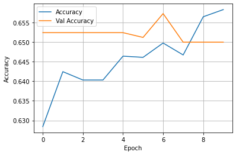

## Wednesday (7/21) Response

(1) Overview of Model

- The dataset from this model looks to examine how various features of an individual can help to predict someone's 
wealth. The specific features are rather simple, being age, gender, size, and education level. Due to there being so 
  few features, setting the feature columns wasn't that complex of a task. Age was the only feature that I placed
  in the numeric column. Age also was bucketized along with edu. The remaining features, size and gender, were both 
  placed in indicator columns. The final step I did prior to training was create a crossed column for edu and age since
  they are highly correlated. After having som issues with loss appearing as nan, I changed the batch size to 132
  and these issues were resolved.

(2) Wealth = 2

- The model appears to be very successful, with an impressive accuracy and minimal loss. The model does not deserve too
much praise because most of its success can be attributed to the fact it is the least common wealth class by far. This
  makes it much easy to train because there is much less data to examine. With this being said this model should not
  be considered that impressive due to the limited amount of class 2 wealth points available to train.
  
(3) Wealth = 3

- This model was still ok, but far less successful than the previous wealth class. Both accuracy on the training
group and validation group fell almost .1. This can be associated with the increase in individuals who fall within the 
  wealth 3 range, making the model more complex and therefore harder to train. 

(4) Wealth = 4

- This model was far, far worse than the previous two, reaching a peak accuracy of around 0.66. The training loss 
  appeared to have a consistent decline, but the validation loss was a little unpredictable. With this odd movement in
  validation loss, the validation accuracy saw odd movement as well, with it ending lower than it started. 

(5) Wealth = 5

- This model once again, had an awful accuracy. The validation and training accuracy were both subpar, peaking at 
around 0.62. The one improvement with this model compared to previous wealth classes is that this is the first time an
  increase in validation accuracy can be seen. In all the other model's validation accuracy remained relatively stagnant,
  where here it begins at 0.54 and improves to 0.61 by the final epoch. 
  

(6) Final Observations

- A definite trend can be seen within this model. As the target wealth class increases, the accuracy begins to plummet.
I'm not sure if this factor can be attributed to the increase in sample size as the wealth class goes up, which would
  explain why 5 and 4 had similar accuracies since they had a similar number of people, or if there was some sort of error 
  on my end in assigning feature columns. All in all this was an interesting model that with more editing of feature
  columns and other factors hopefully could become much more accurate.