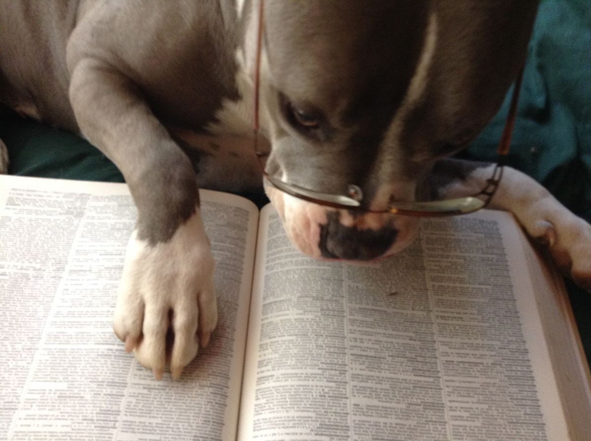
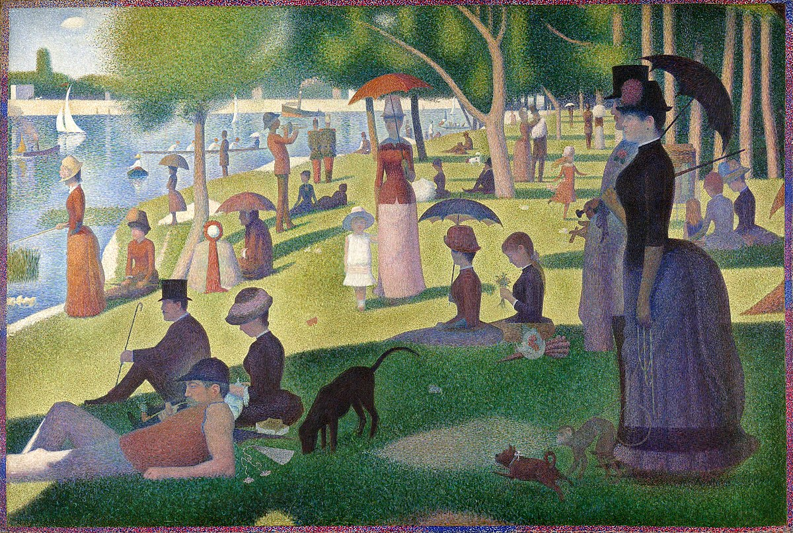
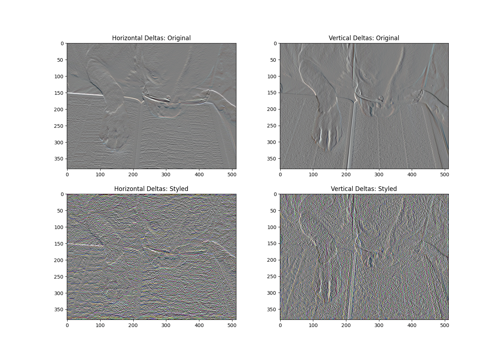
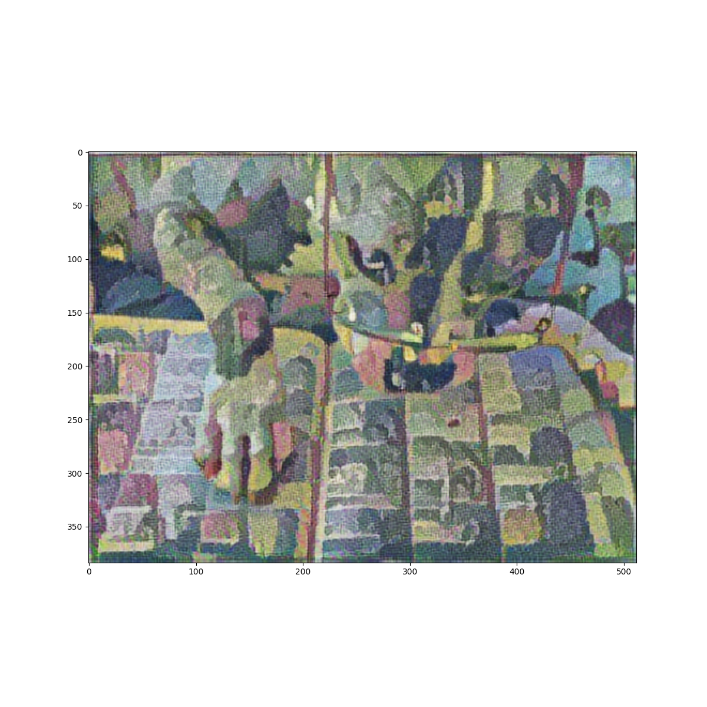
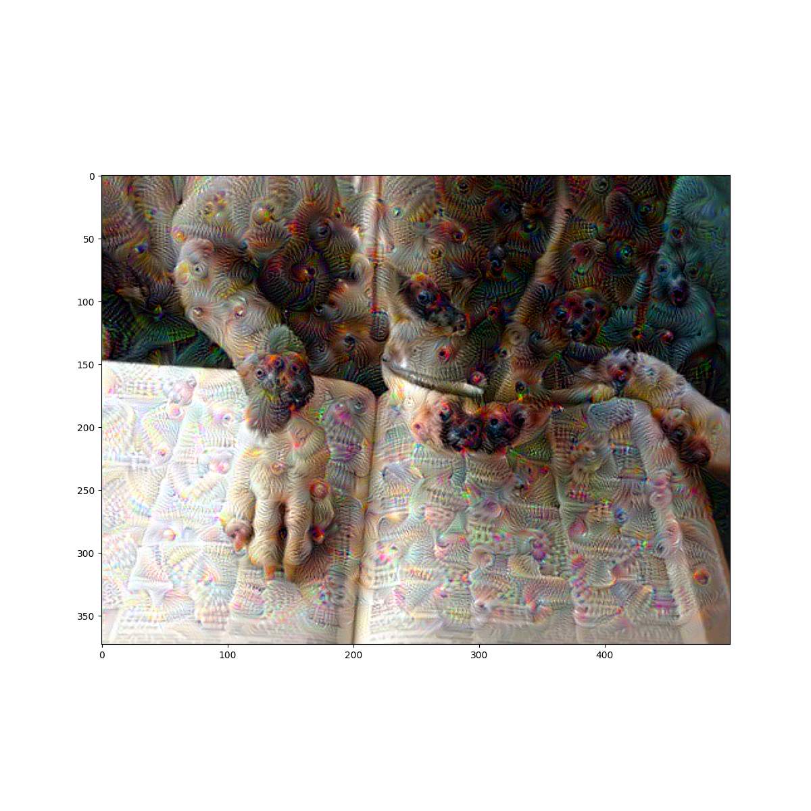
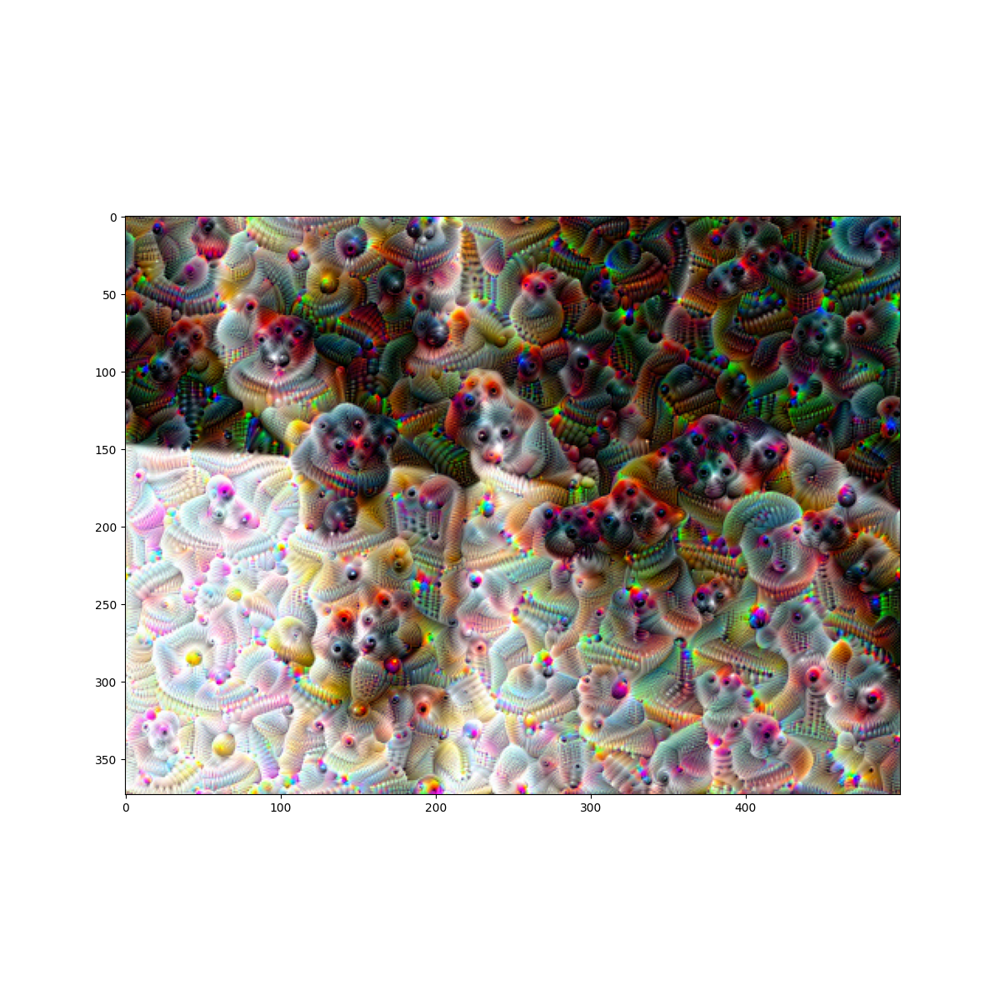
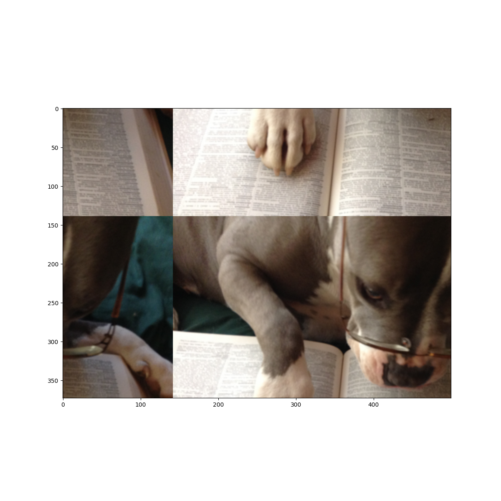

## Wednesday (7/28) Response

(1) Show Images and Results

Primary Image:

Art Image:

Final Product:

(2) What do these images mean to you?

- 	The two images I choose convey my jump start experience, as well as my summer as a whole, very well. 
     The first image is a picture of a random dog wearing glasses while reading a book. This image carries several 
     different meanings. The first is that this summer I have had a lot of work I’ve had to manage due to the heavy 
     workload of the program. The second is that the image is of a dog, which reminds me of my dog, who  I credit 
     with keeping much of my stress down this summer. The second image I used was of the famous painting A Sunday 
     Afternoon on the Island of La Grande Jatte. I choose this image because I actually got to see it in person in late 
     June of this year when I visited Chicago to see my girlfriend. This relates to the class because even with the 
     heavy workload of the jump-start program, I still got to have a fun summer and partake in lots of cool and new 
     things.

(3) Stretch Goal (Deep Dream)

